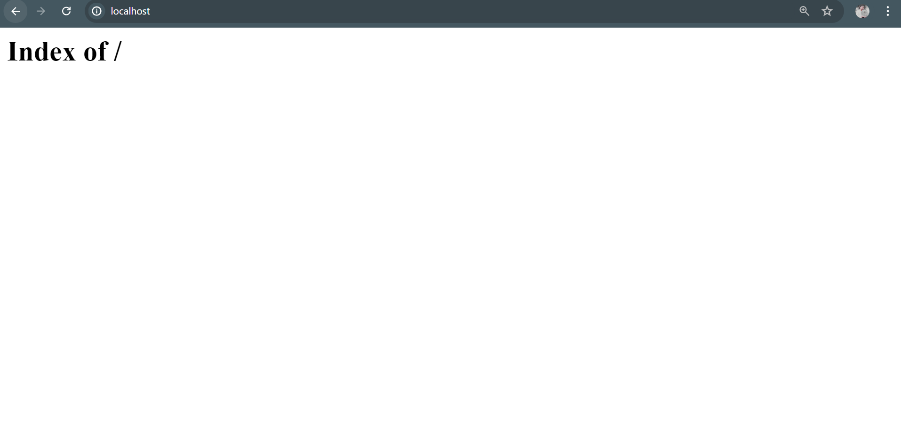
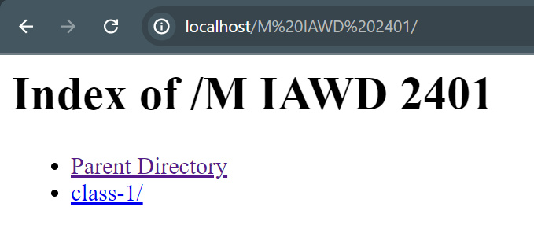

## what is php?

> PHP (recursive acronym for PHP: Hypertext Preprocessor) is a widely-used open source general-purpose scripting language that is especially suited for web development and can be embedded into HTML. `Although PHP's development is focused on server-side scripting,but you can do much more with it`

Nice, but what does that mean by it can be embedded into HTML? An example:

```php
    <!DOCTYPE html>
<html>
    <head>
        <title>Example</title>
    </head>
    <body>

        <?php
            echo "Hi, I'm a PHP script!";
        ?>

    </body>
</html>

```

# PHP Creator.

> It was originally created by Danish-Canadian programmer `Rasmus Lerdorf` in 1993 and released in 1995


# What is the full form of PHP?

>The full form of PHP is `Hypertext Preprocessor`. It was abbreviated previously as `Personal Home Page`.

# What can PHP do?

>Anything. PHP is mainly focused on server-side scripting, so you can do anything any other CGI program can do, such as collect form data, generate dynamic page content, or send and receive cookies. But PHP can do much more.

## There are three main areas where PHP scripts are used.

- Server-side scripting.
- Command line scripting.
- Writing desktop applications.
- [`checkout for more details.`](https://www.php.net/manual/en/intro-whatcando.php)

## Environment Setup of PHP!

### we can use `laragon or xampp or wamp for run the php project on our local pc or machine!

## we use `Laragon.`

### why `Laragon`?

> “Laragon is a portable, isolated, fast, and powerful universal development environment for PHP, NodeJS, Python, Java, Go, and Ruby. It is fast, lightweight, easy to use, and easy to extend.” True to their words, LARAGON is powerful.

[`Download Link - Laragon`](https://laragon.org/download/)

`After install laragon all we need to do for now that is botton left corner there might have a button called start all just click there.then laragon run the apache server and mysql on our local pc or machine then just open a browser like crome and write localhost then enter then you can see this..`


> now all we need to do! just go to your installing dir like me `C:\laragon\www`. how you can create folder or file to play the php code or do some project! previous screen-short we can see a page this is coming form the `C:\laragon\www\index.php` as a root. if you delete this file then its show blank white screen with `Index of` text!



`bcoz we dont have any root(index.php) file to open!`

`now you have to create some folder and file In WWW (M IAWD 2401/class-1/variable.php) dir then if you see on the browser its showing like this`


`in M IAWD 2401 Folder`



```you can notice that there have `Parent Directory` thats mean **M IAWD 2401** is the parent of this folder.now you can create a file and run this and show the output in the browser using the localhost:folderNameOrFilename also you can navigate```


# Escaping from HTML

> Everything outside of a pair of opening and closing tags is ignored by the PHP parser which allows PHP files to have mixed content. This allows PHP to be embedded in HTML documents, for example to create templates.

```php 
<p>This is going to be ignored by PHP and displayed by the browser.</p>
<?php echo 'While this is going to be parsed.'; ?>
<p>This will also be ignored by PHP and displayed by the browser.</p> 

```
> This works as expected, because when the PHP interpreter hits the ?> closing tags, it simply starts outputting whatever it finds (except for the immediately following newline - see instruction separation) until it hits another opening tag unless in the middle of a conditional statement in which case the interpreter will determine the outcome of the conditional before making a decision of what to skip over. See the next example.
Using structures with conditions

# Example #1 Advanced escaping using conditions

```php

<?php if ($expression == true): ?>
  This will show if the expression is true.
<?php else: ?>
  Otherwise this will show.
<?php endif; ?>

```

> In this example PHP will skip the blocks where the condition is not met, even though they are outside of the PHP open/close tags; PHP skips them according to the condition since the PHP interpreter will jump over blocks contained within a condition that is not met.
For outputting large blocks of text, dropping out of PHP parsing mode is generally more efficient than sending all of the text through echo or print.

# Note:

> If PHP is embeded within XML or XHTML the normal PHP <?php ?> must be used to remain compliant with the standards. [org-doc](https://www.php.net/manual/en/language.basic-syntax.phpmode.php)