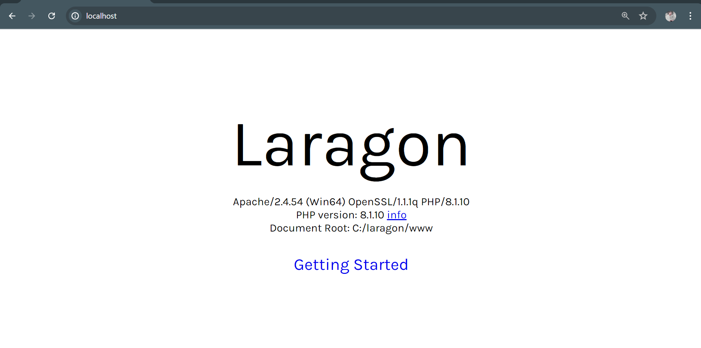
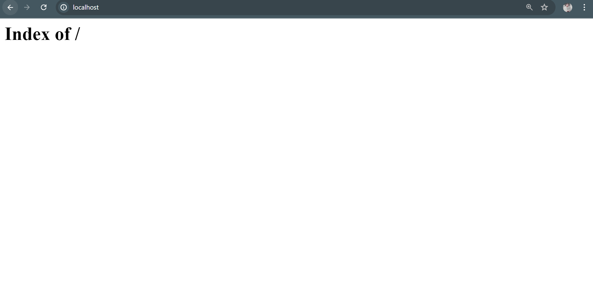
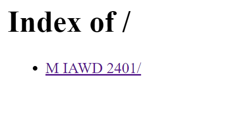
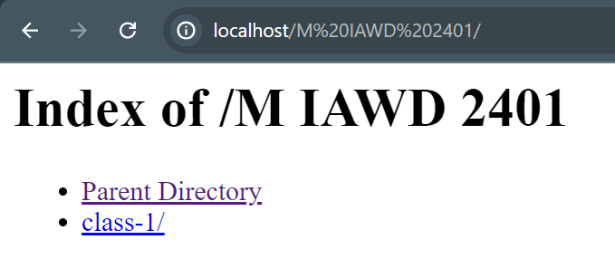

## Environment Setup of PHP!

### we can use `laragon or xampp or wamp for run the php project on our local pc or machine!

## we use `Laragon.`

### why `Laragon`?

> “Laragon is a portable, isolated, fast, and powerful universal development environment for PHP, NodeJS, Python, Java, Go, and Ruby. It is fast, lightweight, easy to use, and easy to extend.” True to their words, LARAGON is powerful.

[`Download Link - Laragon`](https://laragon.org/download/)

`After install laragon all we need to do for now that is bottom left corner there might have a button called start all just click there.then laragon run the apache server and mysql on our local pc or machine then just open a browser like crome and write localhost then enter then you can see this..`




> now all we need to do! just go to your installing dir like me `C:\laragon\www`. how you can create folder or file to play the php code or do some project! previous screen-short we can see a page this is coming form the `C:\laragon\www\index.php` as a root. if you delete this file then its show blank white screen with `Index of` text!



`bcoz we dont have any root(index.php) file to open!`

`now you have to create some folder and file In WWW (M IAWD 2401/class-1/variable.php) dir then if you see on the browser its showing like this`




`in M IAWD 2401 Folder`



```you can notice that there have `Parent Directory` thats mean **M IAWD 2401** is the parent of this folder.now you can create a file and run this and show the output in the browser using the localhost:folderNameOrFilename also you can navigate```